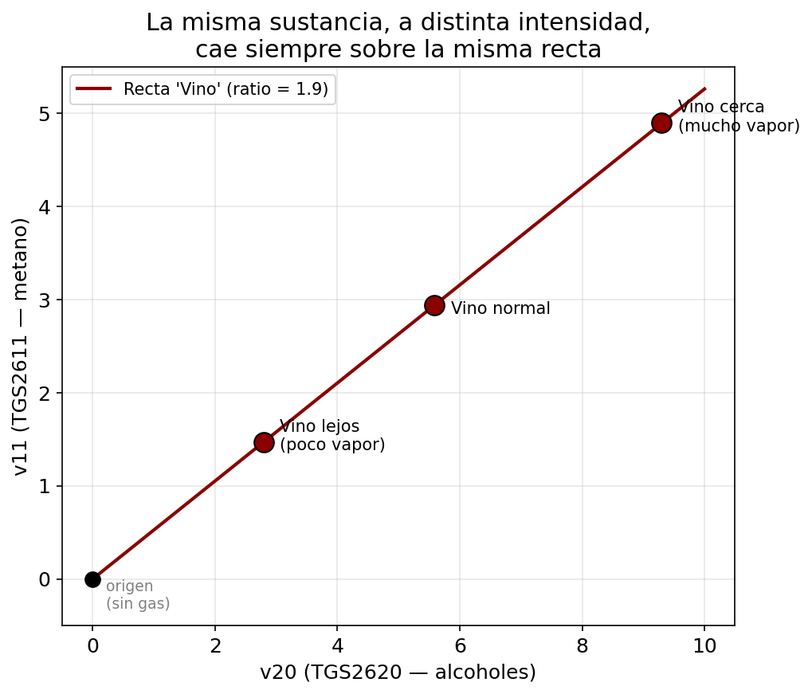
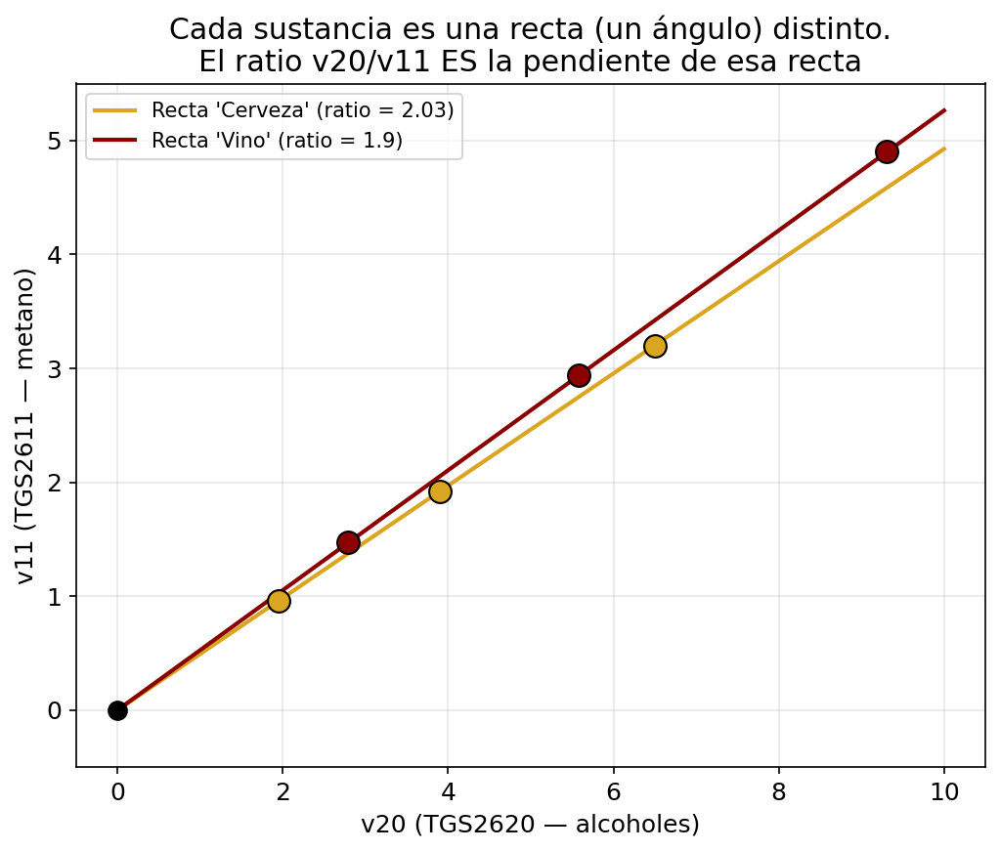
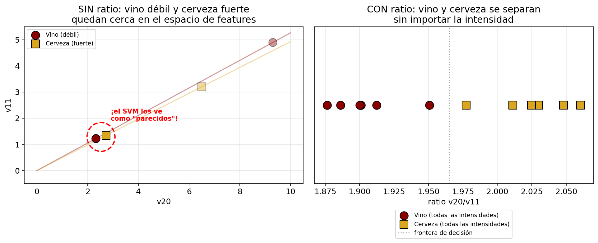

# Cómo funcionan las características y el modelo — guía del proceso completo

Este documento explica, paso a paso y con el "por qué" de cada decisión, cómo el
pipeline transforma las curvas crudas de los sensores en una predicción de la
sustancia medida. Incluye un **ejemplo numérico** (valores realistas) para ver el
flujo entero de principio a fin.

---

## El problema: de señal temporal a vector de longitud fija

Cada vez que el array de sensores huele una sustancia, cada uno de los 4 sensores
TGS genera una **curva de lectura ADC en el tiempo** durante la fase `medicion`
(muestreada a ~4–5 Hz). El clasificador (SVM) necesita vectores de **longitud fija y
comparable**: no puede comer series temporales de longitud variable. Por eso existe
la cadena de procesamiento que convierte cada grabación en una fila de números.

```
Lectura ADC
    │       ╭──╮
    │      ╱    ╲
    │─────╱      ╲──────  ← sensor v20 (TGS2620) durante la fase 'medicion'
    └──────────────────── tiempo
```

---

## De dónde vienen los datos ahora

Antes los datos eran CSV planos en `datasets/` (los volcaba el `serial-reader`).
**Ahora** los recoge la API (`api/`) en una base de datos PostgreSQL, con este modelo:

| Tabla | Qué es |
|-------|--------|
| `sensor` | Los 4 TGS: `tgs2620`, `tgs2611`, `tgs2602`, `tgs2600` (ids 1–4) |
| `sample` | Una sustancia medida: `name`, `n_repetitions`, `completed_repetitions`. Ej.: "Don Simon Tinto", 3 repeticiones |
| `measurement_set` | Un ciclo `base→medicion(→cooldown)` dentro de un sample = **una repetición = una "grabación"** para el ML |
| `reading` | Un instante: `arduino_ms`, `estado`, `captured_at`, ligado a su sample y measurement_set |
| `reading_value` | **4 filas por `reading`** (un valor ADC por sensor) |

### Las fases (columna `estado`)

| Fase | Qué es | Uso en el ML |
|------|--------|--------------|
| `base` | Reposo en aire limpio antes de exponer | Se promedia → **R0** (línea base) |
| `medicion` | Exposición activa a la sustancia | Es la **señal** que se caracteriza |
| `cooldown` | Recuperación en aire limpio tras la exposición | **Se descarta** (de momento) |

> La **"estabilización"** no es una etiqueta aparte en `estado`: es el *criterio* que
> termina cada fase (el observer pasa de `base` a `medicion`, y corta `medicion`,
> cuando la pendiente de todos los sensores se aplana). El "plateau" estable es la
> cola de `medicion`, no una fase con nombre propio.

### Una grabación = un `measurement_set`; 3 repeticiones por sustancia

Cada `measurement_set` es una grabación independiente. Con `n_repetitions = 3` cada
sustancia produce **3 grabaciones**, que son justo lo que el modelo necesita para una
validación honesta (ver "Validación por grupos").

### Puente DB → pipeline

El endpoint `GET /export/recordings` de la API pivota `reading_value` (4 filas → 4
columnas), descarta `cooldown`, y devuelve JSON con las grabaciones listas. El script
`train_from_api.py` (en `implementacion/`) hace fetch de ese endpoint, convierte cada
grabación a DataFrame, extrae las 60 features (estadísticos + ratios), genera
`dataset_maestro.csv` y lanza el entrenamiento — todo sin CSVs intermedios.

---

## Dos modos de extracción de características

Se elige con `FEATURE_MODE` en [`src/enose/config.py`](../src/enose/config.py):

| Modo | Qué produce | ¿Usa PCA? | Estado |
|------|-------------|-----------|--------|
| **`handcrafted`** | 3 estadísticos (max, AUC, slope) por sensor × ventana | No | **Por defecto** |
| `pca_signal` | Los segmentos crudos por sensor × ventana; el PCA los reduce en la Fase 5 | Sí | Alternativo |

> El modo activo es `handcrafted`, que **no usa PCA**. El PCA solo entra si cambias a
> `pca_signal`. Las dos primeras secciones (Fase 4 común + handcrafted) describen lo
> que ocurre en la configuración actual.

---

## Fase 4 (común a ambos modos): de señal cruda a señal limpia

### Paso 1 — Suavizado (Savitzky-Golay)

Reduce el ruido de alta frecuencia preservando la forma del pico. Ventana = 9
muestras (~2 s); debe ser impar.

```
Señal cruda (ruidosa)  →  Savitzky-Golay (ventana=9, orden=3)  →  Señal suavizada
```

### Paso 2 — Normalización por línea base

La lectura absoluta varía entre sesiones, temperaturas y dispositivos. Para que las
muestras sean comparables:

```
R_normalizada = (Rs - R0) / R0
```

`R0` = media de la fase `base` (aire limpio, lectura ADC del divisor de tensión);
`Rs` = lectura suavizada en cada instante. Como el ADC lee voltaje (no resistencia),
la lectura **sube** cuando el sensor responde → `Rs > R0` → el resultado parte de
~0 y crece durante la exposición.

### Paso 3 — Segmentación en ventanas temporales

La señal normalizada se divide en 3 ventanas fijas (segundos desde el inicio de
`medicion`):

| Ventana | Intervalo | Qué captura |
|---------|-----------|-------------|
| `w0-5`  | 0–5 s     | Respuesta inicial |
| `w5-15` | 5–15 s    | Respuesta principal |
| `w15-40`| 15–40 s   | Saturación / estabilización |

4 sensores × 3 ventanas = **12 combinaciones (sensor × ventana)**.

---

## Modo handcrafted (por defecto): 3 estadísticos por ventana

De cada segmento (sensor × ventana) se calculan **3 números**:

| Métrica | Qué mide | Cómo se calcula |
|---------|----------|-----------------|
| `max`   | Altura máxima de la respuesta | `np.max(seg)` |
| `auc`   | Área bajo la curva | `np.trapezoid(seg, dx)` |
| `slope` | Pendiente más pronunciada | `max(\|Δseg / dt\|)` |

Resultado: **4 sensores × 3 ventanas × 3 métricas = 36 características** por grabación.

### Ratios entre sensores: la huella química

#### El problema de los valores absolutos

Las 36 features anteriores (max, AUC, slope) miden la **magnitud** de la respuesta de
cada sensor. Pero esa magnitud depende de factores que **no son la sustancia**:

- **Distancia/flujo**: más lejos del sensor → menos vapor → valores más bajos.
- **Temperatura ambiente**: afecta la evaporación → cambia la concentración.
- **Drift del sensor**: la línea base varía entre días.
- **Cantidad vertida**: más líquido → más vapor.

Dos mediciones de la misma cerveza pueden dar valores absolutos muy distintos
simplemente porque una vez se acercó más la muestra. Y dos bebidas distintas pueden
dar valores absolutos parecidos si una se acercó más que la otra. Con solo magnitudes,
el SVM confunde "intensidad" con "identidad".

#### Cómo funcionan los sensores TGS

Los 4 sensores son **MOS (Metal Oxide Semiconductor)**. Tienen una capa de dióxido de
estaño (SnO₂) calentada a ~300-400°C. En aire limpio, el oxígeno se adsorbe en la
superficie y la resistencia es alta. Cuando llega un gas reductor (etanol, ésteres,
aldehídos…), reacciona con el oxígeno adsorbido, la resistencia **baja**, y el voltaje
del divisor de tensión **sube** — es lo que lee el ADC.

Cada sensor tiene la capa **dopada de forma distinta**, lo que le da una curva de
sensibilidad propia. No es que uno solo detecte etanol y otro solo VOCs — **los 4
detectan etanol**, pero con distinta intensidad relativa:

| Sensor | Nombre | Selectividad principal | También responde a |
|--------|--------|----------------------|-------------------|
| v20 | TGS2620 | **Alcoholes** (etanol, metanol, solventes orgánicos) | Vapores de hidrocarburos |
| v11 | TGS2611 | **Metano**, gas natural | Etanol (pero menos que TGS2620) |
| v02 | TGS2602 | **VOCs** (compuestos orgánicos volátiles), amoniaco, H₂S | Etanol, tolueno |
| v00 | TGS2600 | **Hidrógeno**, CO, contaminantes generales | Etanol, isobutano |

Esta **selectividad cruzada** (todos responden a todo, pero en distinta proporción)
es precisamente lo que hace posible la nariz electrónica: no necesitas un sensor
específico para cada gas — necesitas un **array** con selectividades distintas y
analizar el **patrón** de respuesta.

#### Qué es un ratio y por qué funciona

El ratio `v20/v11` es la **división** entre la respuesta normalizada del TGS2620 y
la del TGS2611 en la misma ventana temporal:

```
ratio = max(señal_normalizada_v20 en ventana) / max(señal_normalizada_v11 en ventana)
```

Con datos reales del 29-jun, Don Simon Tinto rep1 vs Estrella Galicia rep1:

```
Don Simon Tinto (vino tinto):
  v20 normalizado pico w5-15 = 9.3   (ADC subió 9.3× sobre su base)
  v11 normalizado pico w5-15 = 4.9   (ADC subió 4.9× sobre su base)
  ratio v20/v11 = 9.3 / 4.9 = 1.90

Estrella Galicia (cerveza):
  v20 normalizado pico w5-15 = 6.5
  v11 normalizado pico w5-15 = 3.2
  ratio v20/v11 = 6.5 / 3.2 = 2.03
```

La cerveza tiene un ratio **más alto** (2.03 vs 1.90): su sensor de alcoholes "gana"
proporcionalmente más sobre el sensor de metano. ¿Por qué? La cerveza tiene un perfil
volátil más dominado por etanol puro y menos por ésteres/aldehídos complejos que el
vino tinto. El TGS2620 (alcoholes) reacciona más al etanol limpio, mientras que en el
vino la mezcla compleja de VOCs activa más al TGS2611 proporcionalmente.

#### Por qué el ratio aporta más que max/auc por sí solos: la intuición geométrica

Cuando se mide una sustancia, en los dos números `v20` y `v11` hay en realidad **dos
cosas distintas mezcladas**:

1. **Cuánto gas llegó** (intensidad) — depende de distancia al sensor, cantidad
   vertida, temperatura, tiempo de exposición.
2. **Qué tipo de gas es** (composición química) — depende de la sustancia.

`max` y `auc` mezclan ambas cosas en el mismo número, sin forma de separarlas
después. El ratio es una manera de **extraer solo la composición y descartar la
intensidad**.

Para verlo, imagina que se pone `v20` en el eje X y `v11` en el eje Y. Cada
medición es un punto en ese plano.



Si se mide la **misma sustancia** más cerca, más lejos, o con más o menos
cantidad, el punto se mueve **a lo largo de una recta que pasa por el origen**.
La sustancia define el **ángulo** de esa recta — su composición hace que `v20` y
`v11` reaccionen siempre en la misma proporción entre sí. La intensidad solo
mueve el punto a lo largo de esa recta, sin cambiar el ángulo.

Ahora dos sustancias distintas:



Cada sustancia es una **recta distinta** (un ángulo distinto), porque su
composición química hace que `v20` y `v11` respondan en proporciones distintas.
**El ratio `v20/v11` es literalmente la pendiente de esa recta** — por
definición no depende de en qué punto de la recta se está (la intensidad), solo
de qué recta es (la sustancia).

**Por qué `max`/`auc` solos confunden al SVM**: el SVM separa clases trazando
fronteras según la distancia entre puntos en el espacio de features. Sin ratio,
una **medición débil de Vino** (cerca del origen) puede caer más cerca de una
**medición intensa de Cerveza** que de otra medición de Vino — si la cerveza se
acercó mucho al sensor y el vino estaba lejos. El SVM ve esos dos puntos
cercanos y los trata como "parecidos", aunque sean sustancias distintas; y ve
"vino cerca" vs "vino lejos" como lejanos, aunque sean la misma sustancia.



En el panel izquierdo, "vino débil" y "cerveza fuerte" caen dentro del mismo
círculo — el SVM los trataría como vecinos. En el panel derecho, el mismo
conjunto de mediciones representado solo por su ratio: todas las de vino caen a
la izquierda de la frontera, todas las de cerveza a la derecha,
**independientemente de la intensidad** con la que se midieron.

Esto es justo lo que se vio en la gráfica de PCA de la sesión del 29-jun: PC1
explicaba el 64% de la varianza y era básicamente **intensidad** — las
sustancias se ordenaban de "respuesta baja" a "respuesta alta" en una sola
línea, sin separarse realmente por tipo. Los ratios atacan exactamente ese
problema.

#### Qué cancela el ratio

Si pones la misma bebida **más lejos** del sensor, los 4 valores bajan (menos vapor
llega), pero bajan **proporcionalmente** porque la composición del gas no cambia. El
ratio se mantiene:

```
Don Simon Tinto (cerca):   v20=9.3  v11=4.9  →  ratio = 1.90
Don Simon Tinto (lejos):   v20=4.7  v11=2.5  →  ratio = 1.88  ← casi igual
```

Los factores que el ratio cancela:
- ✅ Distancia al sensor y flujo de aire
- ✅ Temperatura ambiente (afecta evaporación)
- ✅ Drift de la línea base entre sesiones
- ✅ Cantidad de líquido expuesto

Lo que el ratio **conserva**:
- ✅ La composición relativa de los gases que emite la sustancia

Eso es la "huella química" — lo que define a la bebida.

#### Por qué esto ayuda a diferenciar marcas

Dos vinos tintos (Don Simon vs Gran arrieiro) tienen perfiles de VOCs parecidos pero
no idénticos: distinta cantidad de taninos volátiles, ésteres de fermentación, ácidos
orgánicos. Con los valores absolutos esas diferencias se pierden en la variabilidad
de intensidad (una medición tuvo más vapor que otra). Con los ratios, las pequeñas
diferencias de composición emergen.

En la práctica, los ratios subieron la accuracy de 36% a 64% en test (11 clases, 3
reps por clase) — casi el doble. Las 7 sustancias que el modelo acierta son las que
tienen ratios estables entre repeticiones.

#### Los 4 pares de sensores

Se calculan `max_ratio` y `auc_ratio` por ventana para cada par:

| Par | Qué mide | Ejemplo de uso |
|-----|----------|----------------|
| `v20/v11` | Alcoholes vs metano/gas | Diferencia grado alcohólico y tipo de fermentación. Más alto en bebidas con etanol dominante |
| `v00/v02` | Contaminantes generales vs VOCs | Captura el perfil aromático. Vinos con más taninos/ésteres bajan este ratio |
| `v20/v02` | Etanol vs VOCs | Alto en cerveza (etanol limpio), bajo en vinos complejos (muchos VOCs) |
| `v11/v00` | Metano vs contaminantes | Complementario — captura diferencias sutiles que los otros pares no ven |

→ **4 pares × 3 ventanas × 2 métricas = 24 ratios** + 36 estadísticos = **60 features**
totales por grabación, más 2 columnas no-feature (`Nombre_Archivo`, `Etiqueta`) → 62
columnas. Son deterministas — no requieren ajuste.

### Ejemplo numérico

Sensor **v20 (TGS2620)** en una grabación con buena respuesta (lecturas ADC, 0–4095).

**1) R0 desde la fase `base`** (aire limpio, valores ADC del divisor de tensión):

```
base v20 = [85, 82, 88, 84, 86, 83]   →   R0 = media ≈ 85
```

**2) Normalización** de un punto de `medicion`. Si en un instante el sensor lee
`Rs = 650` (el ADC sube al exponerse al gas):

```
R_norm = (650 - 85) / 85 = 6.65
```

Aplicado a toda la fase `medicion`, la curva normalizada de v20 sube desde 0, hace
pico y se estabiliza:

```
ventana w0-5  (0–5 s):   0.0 → 2.1 → 4.5           (subida inicial)
ventana w5-15 (5–15 s):  4.5 → 6.2 → 6.7           (pico)
ventana w15-40(15–40 s): 6.7 → 6.6 → 6.5           (meseta/estabilización)
```

**3) Características de v20** (valores ilustrativos):

| Característica | Valor | Lectura |
|---------------|-------|---------|
| `v20_w0-5_max`     | 4.5  | respuesta inicial |
| `v20_w0-5_slope`   | 3.2  | sube rápido al principio |
| `v20_w5-15_max`    | 6.7  | el pico real está en la ventana media |
| `v20_w5-15_auc`    | 58.0 | área grande (señal alta y sostenida) |
| `v20_w15-40_slope` | 0.08 | casi plana → estabilizada |

Repitiendo para `v11`, `v02` y `v00` se obtienen 36 estadísticos.

**4) Ratios** (valores ilustrativos para la ventana w5-15):

Si v11 tiene un pico normalizado de 3.5 en w5-15:

```
ratio v20/v11 en w5-15 = max(v20_w5-15) / max(v11_w5-15) = 6.7 / 3.5 = 1.91
```

Ese 1.91 dice que v20 (alcoholes) reacciona 1.91× más que v11 (metano) en esta
sustancia. Una cerveza podría dar 2.1 y un rosado 1.7 — esa diferencia es la huella
química, independiente de cuánto vapor llega al sensor.

Con los 36 estadísticos + 24 ratios se obtiene la **fila de 60 números** que
representa la grabación.

---

## Modo pca_signal (alternativo): PCA por sensor × ventana

Solo si `FEATURE_MODE = "pca_signal"`. En vez de los 3 estadísticos, se guardan los
**segmentos crudos** (la curva punto a punto) en columnas `{sensor}_{ventana}__t000`,
… y el PCA se aplica **dentro del Pipeline de la Fase 5**, no en la Fase 4.

```
N muestras × ~40 puntos de una ventana  →  PCA  →  N muestras × k componentes
                                                    (k << 40, captura 95% varianza)
```

- **Un PCA por (sensor × ventana)**, no uno global: cada combinación tiene su propia
  escala temporal. Separar el PCA por clave mantiene esa estructura.
- **`explained_variance_threshold = 0.95`**: sklearn elige el nº mínimo de componentes
  que explican el 95% de la varianza de cada clave (en la práctica 2–5).
- **El PCA NO se ajusta en la Fase 4**: si se ajustara sobre todos los datos antes del
  split train/test, el test contaminaría el modelo → *data leakage*.

---

## Fase 5: el Pipeline y el clasificador SVM

```
Fila de características
        │
        ▼
  [PerKeyPCA]          ← SOLO en modo pca_signal (en handcrafted no existe este paso)
        │
        ▼
  StandardScaler       ← cada feature a media=0, std=1
        │
        ▼
  SVM (kernel a elegir) ← clasifica la sustancia
        │
        ▼
    Predicción
```

### Hiperparámetros que optimiza GridSearchCV

| Parámetro | Efecto |
|-----------|--------|
| `kernel`  | `linear` (frontera recta) o `rbf` (fronteras curvas) |
| `C` | Penalización por error. Alto → ajuste fino (overfitting), bajo → margen amplio |
| `gamma` (solo rbf) | Radio de influencia de cada muestra |

El grid prueba `C ∈ {0.1, 1, 10, 100}` (`linear`) y además `gamma ∈ {scale, auto,
0.1, 0.01}` (`rbf`). La métrica que decide el mejor modelo es **`balanced_accuracy`**
(media de los recalls por clase), no `accuracy`.

---

## Validación por grupos: evitar fuga entre repeticiones de la misma sustancia

Las 3 repeticiones (measurement_sets) de una misma sustancia son muy parecidas entre
sí. Con un split aleatorio acabarían repartidas entre train y test, y el modelo
"reconocería" en el test una grabación casi idéntica que ya vio en train → memoriza en
vez de generalizar, inflando la métrica.

La solución es agrupar por **grabación** (`StratifiedGroupKFold`): el grupo es el
`measurement_set` (en el export, el sufijo de nombre lo identifica). Así **ninguna
repetición aparece a la vez en train y test**, y la métrica refleja la capacidad de
clasificar **una medición nueva** de las sustancias conocidas.

> Por eso se exigen **≥2 grabaciones por clase**: con `n_repetitions = 3` se cumple de
> sobra (3 grupos por clase).

---

## Estado actual de los datos (importante)

Sesión del 29-jun-2026 — **11 sustancias con 3 repeticiones completas** cada una:

| Sample | Tipo |
|--------|------|
| Don Simon Tinto | vino tinto |
| Estrella Galicia | cerveza |
| Aloumiña Ovella Negra | vino |
| Don Simon Blanco | vino blanco |
| Gran arrieiro tinto | vino tinto |
| don garcia blanco | vino blanco |
| don garcia rosado | rosado |
| skol cerveza | cerveza |
| san miguel cerveza 2 | cerveza |
| 1906 | cerveza |
| red vintage | vino tinto |

→ **11 clases × 3 reps = 33 grabaciones**. El export vía API (`GET /export/recordings`)
y el script `train_from_api.py` alimentan el pipeline directamente sin CSVs intermedios.

**Resultados del primer entrenamiento** (60 features con ratios, SVM linear C=0.1):
- Train accuracy: 100% | Test accuracy: 63.6% | Test balanced accuracy: 63.6%
- 7/11 clases acertadas en test. Las que fallan son las que tienen más variabilidad
  entre repeticiones (CV% alto en el heatmap de repetibilidad).

Caveats:
- **Duración de `medicion` muy variable** (35 s vs 300 s+): sin timeout, las muestras
  que no estabilizan corren larguísimo. Pendiente implementar ese timeout.
- **Repetibilidad**: algunas sustancias tienen CV% de 30-40% en ciertos sensores
  (especialmente TGS2602 y TGS2600). Más repeticiones (10+) mejorarían la estabilidad.
- **Encoding:** "Aloumiña" = UTF-8 mal interpretado al escribir/leer; corregir.

---

## Inferencia: clasificar una medición nueva

1. Grabar los 4 sensores con sus fases `base`/`medicion` (la API ya lo hace).
2. Tomar R0 de `base`, suavizar y normalizar (mismo proceso que en entrenamiento).
3. Segmentar `medicion` en las 3 ventanas.
4. Extraer las 60 características (36 estadísticos + 24 ratios entre sensores).
5. Pasar la fila a `best_model.pkl` — el Pipeline hace el resto.

```python
import pickle, pandas as pd
model = pickle.load(open("datos/procesados/best_model.pkl", "rb"))
pred = model.predict(nueva_fila_df)   # → ['Don Simon Tinto']
```

> El escalado, el (opcional) PCA y la clasificación viajan dentro del mismo objeto
> Pipeline: no se necesita ningún archivo auxiliar de transformadores.

---

## Resumen visual del flujo completo (modo handcrafted, el actual)

```
PostgreSQL (sample → measurement_set → reading → reading_value; base/medicion/cooldown)
         │
         │  API: GET /export/recordings (pivota sensores, descarta cooldown)
         ▼
train_from_api.py (fetch → DataFrame → features → train)
         │
         │  Fase 4
         ├─ R0 de la fase 'base' + suavizado Savitzky-Golay (ventana=9)
         ├─ Normalización (Rs − R0) / R0 sobre la fase 'medicion'
         ├─ Segmentación en 3 ventanas × 4 sensores = 12 segmentos
         ├─ 3 estadísticos (max, AUC, slope) por segmento → 36 features
         └─ 4 ratios entre sensores × 3 ventanas × 2 métricas → 24 features
            → dataset_maestro.csv (60 features totales)
         │
         │  Fase 5 (≥2 grabaciones por clase: se cumple con 3 repeticiones)
         ├─ StandardScaler: media=0, std=1
         └─ SVM: GridSearchCV con StratifiedGroupKFold por measurement_set (balanced_accuracy)
            → best_model.pkl
         │
         ▼
  Predicción: la sustancia (Don Simon Tinto / Estrella Galicia / ...)
```
