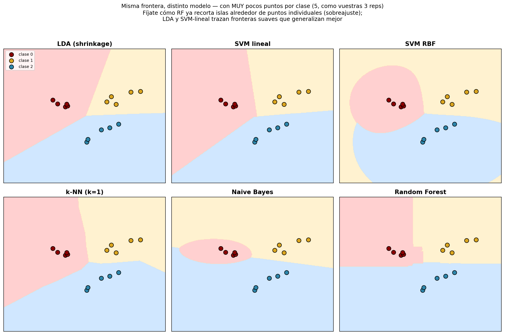
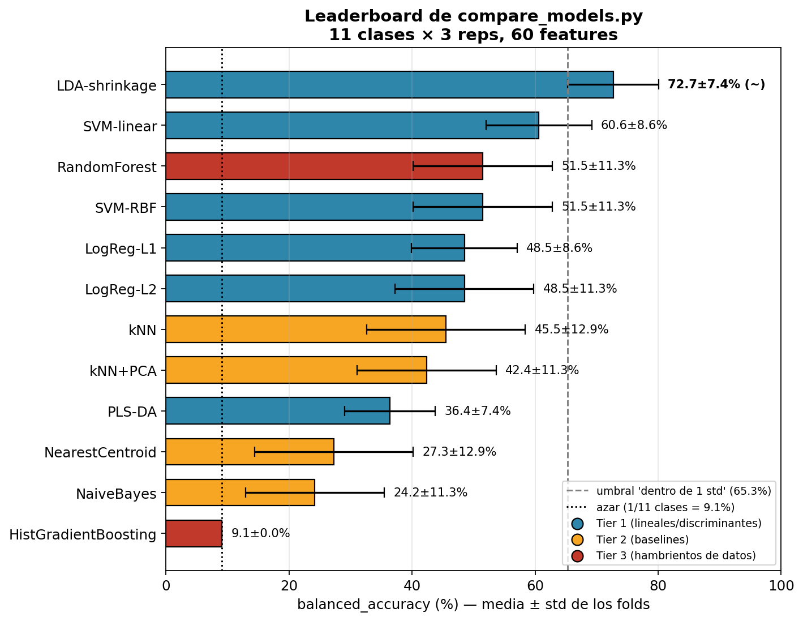

# Modelos de clasificación — cómo funciona cada uno

Guía de los clasificadores que compara el harness [`compare_models.py`](../compare_models.py).
Para cada modelo: la **intuición** de cómo decide, un **ejemplo** en el dominio de la
nariz electrónica, sus **fortalezas y debilidades**, cómo **rindió** con los datos
actuales (11 sustancias × 3 reps, 60 features) y **cuándo brilla**.

El modelo de producción actual es **LDA con shrinkage** (ganó el harness). Se cambia
en `CLASSIFIER` dentro de [`src/enose/config.py`](../src/enose/config.py).

---

## El problema y cómo se evalúa

Cada grabación es un **punto en un espacio de 60 dimensiones** (las 60 features:
estadísticos + ratios). Clasificar = trazar fronteras en ese espacio que separen las
11 sustancias. Cada familia de modelos traza esas fronteras de una forma distinta:

- **Lineales / discriminantes** (LDA, PLS-DA, LogReg, SVM-linear): fronteras planas
  (hiperplanos). Pocos parámetros → robustos con pocos datos.
- **De margen no lineal** (SVM-RBF): fronteras curvas.
- **Por distancia** (kNN, Nearest Centroid): "se parece a sus vecinos".
- **Probabilísticos** (Naive Bayes): "qué clase hace estos valores más probables".
- **Árboles / ensembles** (Random Forest, HistGradientBoosting): reglas if/else
  combinadas. Muy flexibles → necesitan muchos datos.

Para que se vea físicamente la diferencia, esto es la **misma frontera con 6 modelos
distintos**, sobre datos sintéticos en 2D con solo 5 puntos por clase (deliberadamente
pocos, como vuestras 3 reps por sustancia):

Fíjate en tres cosas:
- **LDA y SVM-lineal** trazan una línea recta limpia entre clases — simple, estable,
  generaliza bien aunque haya pocos puntos.
- **SVM-RBF** ya curva la frontera (la "burbuja" rosa alrededor de la clase 0):
  más flexible, pero con pocos datos puede curvar de más.
- **Random Forest** empieza a recortar **escalones** pegados a puntos individuales
  (mira el borde irregular entre rojo y amarillo) — la primera señal de sobreajuste.
  Con más puntos por clase esos escalones desaparecerían y RF generalizaría mejor.

### Cómo se mide (y por qué importa)

Todos se evalúan igual: **balanced_accuracy** (media de los aciertos por clase, para
que las clases no se "coman" unas a otras) con **StratifiedGroupKFold agrupando por
grabación** — ninguna repetición de una sustancia aparece a la vez en train y test, así
que el número refleja clasificar una **medición nueva**, no memorizar.

> **Regla de oro con pocos datos:** el harness reporta media ± desviación entre folds.
> Diferencias **menores que la desviación NO son significativas**. Entre modelos
> "empatados" (marcados con `~`), se elige el **más simple** (navaja de Occam).

---

# Tier 1 — encajan con pocas muestras y features colineales

## LDA — Linear Discriminant Analysis (con shrinkage) ★ modelo actual

**Cómo funciona.** Busca las direcciones del espacio que **maximizan la separación
entre clases y minimizan la dispersión dentro de cada clase**. Imagina proyectar la
nube de puntos sobre un eje: LDA elige el eje donde los grupos quedan más despegados y
cada grupo más compacto. Asume que cada clase es una "burbuja" gaussiana y que todas
comparten la misma forma de dispersión (covarianza).

**El "shrinkage" es la clave aquí.** Con 60 features y 33 muestras, la matriz de
covarianza que LDA necesita estimar es **degenerada** (no se puede invertir bien: hay
más dimensiones que datos). El shrinkage la "encoge" hacia una versión simple y
estable —un compromiso entre la covarianza medida (ruidosa) y la identidad (rígida)—.
Es regularización pura. Sin él, LDA explota con p>n; con él, es de los mejores.

**Ejemplo.** Con v20 (alcoholes) y v11 (metano): LDA encuentra que la dirección
"v20 − 1.5·v11" separa vinos de cervezas mejor que cualquier sensor solo, y proyecta
cada medición sobre ese eje para decidir.

**Fortalezas.**
- Diseñado para p>n con shrinkage → ideal para vuestro régimen.
- Pocos parámetros, no se sobreajusta fácil, rapidísimo, sin tuning real.
- Clásico absoluto de quimiometría y e-nose.
- Da `decision_function` para ranking de confianza.

**Debilidades.**
- Fronteras solo lineales (asume burbujas gaussianas de igual forma).
- Exige **más muestras que clases en cada fold** (con 11 clases y 3 reps obligó al
  trainer a evaluar por CV sobre todo el dataset, sin holdout — ver `trainer.py`).
- Si dos sustancias tienen dispersión muy distinta, la asunción de covarianza común
  le perjudica.

**Resultado en el harness:** **72.7 % ± 7** — el mejor, y único dentro de 1 std del top.
**Brilla cuando:** pocas muestras, features correlacionadas, clases razonablemente
gaussianas. Justo vuestro caso hoy.

---

## PLS-DA — Partial Least Squares Discriminant Analysis

**Cómo funciona.** Es el **estándar de quimiometría** para discriminar alimentos/bebidas.
Primero comprime las 60 features en unas pocas **variables latentes** (combinaciones de
features), pero —a diferencia del PCA, que solo busca varianza— las elige para que
**correlacionen con la etiqueta de clase**. Luego clasifica sobre esas pocas variables.
Es "PCA supervisado + regresión".

**Ejemplo.** En vez de mirar las 60 features, PLS-DA podría descubrir que 3
combinaciones ("intensidad global", "ratio alcohol/VOC", "velocidad de respuesta")
capturan casi toda la diferencia entre sustancias, y decide sobre esas 3.

**Fortalezas.**
- Maneja p≫n y features muy colineales **por construcción** (es su razón de ser).
- Las variables latentes son interpretables (puedes ver qué features pesan).
- Domina la literatura de discriminación de vinos/cervezas.

**Debilidades.**
- Sensible al nº de componentes latentes (hiperparámetro a tunear).
- Como hace su propia normalización interna, **chocó con el StandardScaler** que lleva
  delante en el harness — probablemente por eso rindió por debajo de lo esperado.
- Con muy pocas muestras por clase le cuesta estimar buenas latentes.

**Resultado en el harness:** **36.4 % ± 7** (decepcionó; revisar sin el scaler delante).
**Brilla cuando:** discriminación de bebidas con decenas+ de muestras; es el primero a
reprobar cuando crezcan los datos.

---

## SVM — Support Vector Machine (linear / RBF)

**Cómo funciona.** Traza la frontera que deja el **máximo margen** (la "calle" más ancha
posible) entre clases. Solo importan los puntos cercanos a la frontera, los **support
vectors**; el resto no influye. Con kernel **linear** la frontera es un hiperplano; con
kernel **RBF** la frontera se curva (proyecta a un espacio de dimensión infinita donde
clases no separables linealmente sí lo son).

**Ejemplo.** Para separar Estrella Galicia de Don Simon, SVM-linear busca el hiperplano
con el mayor hueco entre las grabaciones de una y otra; las reps "fáciles" (lejos de la
frontera) ni cuentan.

**Fortalezas.**
- Muy efectivo en alta dimensión, incluso con p>n.
- El margen máximo es una forma natural de regularización → generaliza bien.
- RBF captura no linealidades sin diseñar features.

**Debilidades.**
- Con 3 reps/clase **casi todo punto es support vector** → la frontera la dictan puntos
  individuales ruidosos (una rep mala la mueve).
- RBF añade el hiperparámetro `gamma` y se sobreajusta fácil con pocos datos.
- `decision_function` da márgenes poco calibrados (vimos pasos de ~1.0 muy regulares).

**Resultado en el harness:** linear **60.6 % ± 9** (2º), RBF **51.5 % ± 11**.
**Brilla cuando:** alta dimensión con clases bien separadas; el linear es un baseline
fuerte casi siempre.

---

## Regresión Logística (L2 / L1)

**Cómo funciona.** Modela directamente la **probabilidad** de cada clase como una
combinación lineal de las features pasada por una función sigmoide/softmax. Aprende un
peso por feature; el signo y magnitud dicen cuánto empuja esa feature hacia cada clase.
La **regularización** evita que los pesos se disparen con pocos datos:
- **L2 (ridge):** encoge todos los pesos suavemente.
- **L1 (lasso):** pone muchos pesos **exactamente a cero** → selecciona features.

**Ejemplo.** LogReg-L1 podría decidir que de las 60 features solo importan 8 (p. ej.
`r_v20_v02_w5-15_max`, ...) y poner el resto a cero — te dice **qué ratios discriminan**.

**Fortalezas.**
- Lineal, interpretable (pesos por feature), probabilidades calibradas.
- L1 hace selección de features automática (útil para entender el problema).
- Robusto con regularización fuerte.

**Debilidades.**
- Solo fronteras lineales.
- Con p≫n necesita regularización fuerte o se sobreajusta.
- L1 puede ser inestable (qué features elige varía entre folds con pocos datos).

**Resultado en el harness:** L2 **48.5 % ± 11**, L1 **48.5 % ± 9**.
**Brilla cuando:** quieres interpretar qué features mandan, o como baseline lineal sólido.

---

# Tier 2 — baselines de referencia

## k-NN — k vecinos más cercanos

**Cómo funciona.** No "entrena" nada: guarda todas las muestras. Para clasificar una
nueva, mira sus **k vecinos más cercanos** en el espacio de 60-D y vota la clase
mayoritaria. "Si huele como esas 3 grabaciones que ya conozco y todas eran cerveza,
es cerveza."

**Ejemplo.** Una medición nueva cae a distancia 0.2 de una rep de Skol y 0.9 del resto
→ con k=1 la clasifica como Skol.

**Fortalezas.**
- Simplísimo, sin asunciones sobre la forma de las clases.
- Captura fronteras arbitrariamente complejas si hay datos.
- Baseline omnipresente en e-nose.

**Debilidades.**
- **Maldición de la dimensionalidad:** en 60-D todas las distancias se parecen, "cercano"
  pierde sentido. Por eso se le pone un **PCA delante** (kNN+PCA).
- Sensible a la escala (mitigado: escalamos) y al ruido (con k=1, una rep mala = error).
- Lento en inferencia si hay muchas muestras.

**Resultado en el harness:** kNN **45.5 % ± 13**, kNN+PCA **42.4 % ± 11**.
**Brilla cuando:** muchas muestras, pocas dimensiones (o con PCA delante).

## Nearest Centroid

**Cómo funciona.** Calcula el **centro (promedio)** de cada clase y asigna cada muestra
nueva al centro más cercano. Es kNN llevado al extremo: un solo "vecino" por clase, su
centroide.

**Fortalezas.** Ultra-robusto con pocos datos (un promedio es estable), trivial.
**Debilidades.** Asume clases esféricas y bien separadas; ignora la forma y el solape.
**Resultado:** **27.3 % ± 13**. **Brilla cuando:** clases muy separadas y compactas.

---

## Naive Bayes (Gaussiano)

**Cómo funciona.** Aplica el teorema de Bayes asumiendo (ingenuamente) que **todas las
features son independientes** entre sí dentro de cada clase. Modela cada feature como
una gaussiana por clase y multiplica probabilidades: "¿qué clase hace estos 60 valores
más probables a la vez?".

**Fortalezas.** Rapidísimo, funciona con poquísimos datos, pocas asunciones de forma.
**Debilidades.** La asunción de independencia es **falsa aquí**: vuestras features están
muy correlacionadas (max y auc, sensores que suben juntos). Eso le penaliza fuerte.
**Resultado:** **24.2 % ± 11** (de los peores, por la correlación). **Brilla cuando:**
features genuinamente independientes (texto, conteos).

---

# Tier 3 — potentes pero hambrientos de datos

## Random Forest

**Cómo funciona.** Entrena **muchos árboles de decisión** (cada uno una cascada de
reglas "si feature_X > umbral → ...") sobre subconjuntos aleatorios de datos y features,
y promedia sus votos. La aleatoriedad evita que un solo árbol sobreajuste.

**Ejemplo.** Un árbol podría aprender: "si `r_v20_v02 > 1.5` y `v11_max < 4` → cerveza".
El bosque combina cientos de reglas así.

**Fortalezas.**
- Captura interacciones y no linealidades sin diseñarlas.
- Da **importancia de features** (qué ratios/estadísticos pesan más).
- Robusto a outliers y escalas.

**Debilidades.**
- **Necesita muchos datos:** con 33 muestras los árboles memorizan y la importancia de
  features es ruidosa.
- Frontera "escalonada" (cortes ortogonales), no suave.

**Resultado en el harness:** **51.5 % ± 11** (no supera a los lineales hoy).
**Brilla cuando:** cientos+ de muestras; entonces suele adelantar a los lineales.

## HistGradientBoosting (estilo XGBoost/LightGBM)

**Cómo funciona.** Construye árboles **en secuencia**, cada uno corrigiendo los errores
del anterior (boosting). Muy potente: domina competiciones de ML con datos tabulares...
cuando hay datos.

**Fortalezas.** El más preciso de los tabulares con datos suficientes; maneja todo tipo
de features e interacciones.
**Debilidades.** **El más hambriento de datos de todos.** Con 33 muestras y 11 clases no
tiene de dónde aprender.
**Resultado en el harness:** **9.1 % ± 0** = **1/11 = puro azar.** Confirma de forma
brutal que los modelos complejos colapsan con pocos datos.
**Brilla cuando:** miles de muestras. Hoy inútil; será candidato serio cuando crezca el
dataset — y el harness lo mostrará subir automáticamente.

---

## Resumen y cómo usarlo

Leaderboard real de `compare_models.py` sobre el dataset actual (11 clases × 3 reps):

La línea punteada gris marca "dentro de 1 std del mejor" — solo LDA-shrinkage queda
ahí, así que es el único que gana de forma estadísticamente significativa. La línea
punteada negra marca el azar puro (1/11 ≈ 9%): HistGradientBoosting cae exactamente
ahí, la prueba más clara de que con pocos datos un modelo complejo no aprende nada.

| Modelo | Familia | Harness | Fortaleza clave | Talón de Aquiles |
|--------|---------|--------:|-----------------|------------------|
| **LDA-shrinkage** ★ | Discriminante lineal | **72.7%** | p>n con shrinkage | frontera lineal |
| SVM-linear | Margen lineal | 60.6% | alta dimensión | reps ruidosas = SV |
| SVM-RBF | Margen no lineal | 51.5% | no linealidad | sobreajuste, gamma |
| RandomForest | Árboles (bagging) | 51.5% | interacciones | necesita datos |
| LogReg-L2/L1 | Lineal probabilístico | 48.5% | interpretable | solo lineal |
| kNN (+PCA) | Distancia | 45.5% | sin asunciones | maldición dim. |
| NearestCentroid | Distancia | 27.3% | robusto | clases esféricas |
| NaiveBayes | Probabilístico | 24.2% | rápido | asume independencia |
| HistGradientBoosting | Árboles (boosting) | 9.1% | top con datos | hambriento |

**Cómo elegir el modelo de producción:**

1. Corre `python compare_models.py` (usa el `dataset_maestro.csv` actual).
2. Mira el leaderboard: los marcados con `~` están empatados con el mejor dentro del
   ruido. Entre esos, elige el **más simple**.
3. Pon el ganador en `CLASSIFIER` (`src/enose/config.py`) y reentrena con
   `train_from_api.py`. (Hoy: `lda`.)
4. **Re-corre el harness tras cada sesión nueva de datos** — el ranking cambiará. La
   apuesta: conforme crezcan los datos, los tiers 2-3 (RF, boosting) treparán y puede
   que adelanten a LDA. Tener el harness es lo que te deja verlo y decidir con datos,
   no por intuición.

> **Lección transversal:** hoy ganan los modelos **simples y regularizados** (LDA, SVM
> lineal) y se hunden los **complejos** (boosting al nivel del azar). No es que los
> complejos sean malos — es que necesitan datos que aún no tenéis. La complejidad del
> modelo debe ir a la par de la cantidad de datos.
